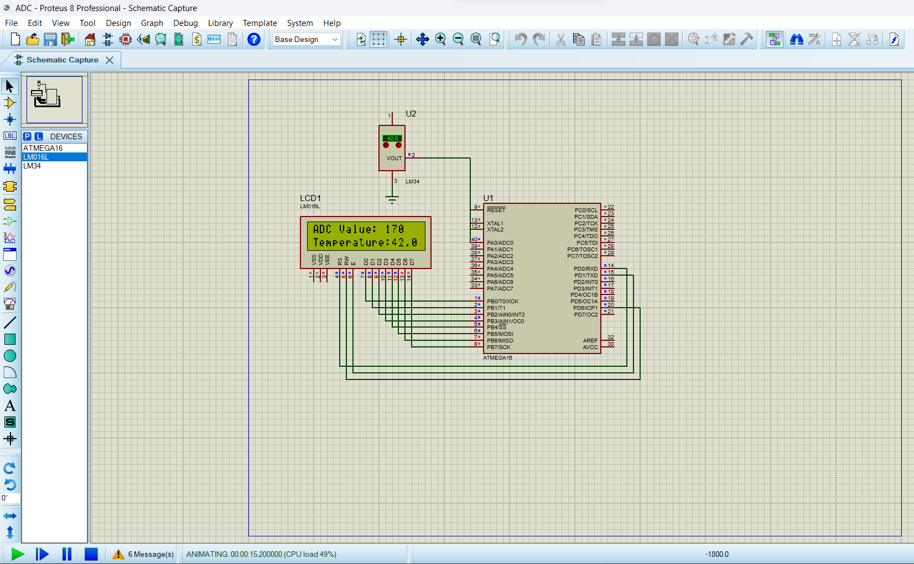
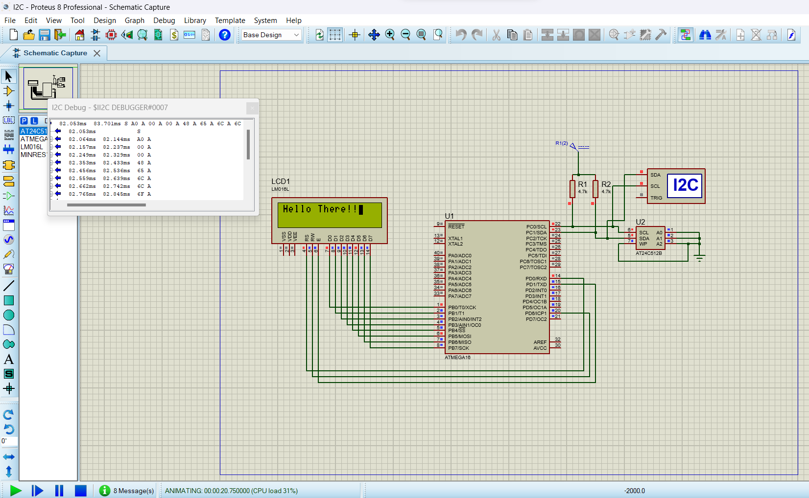
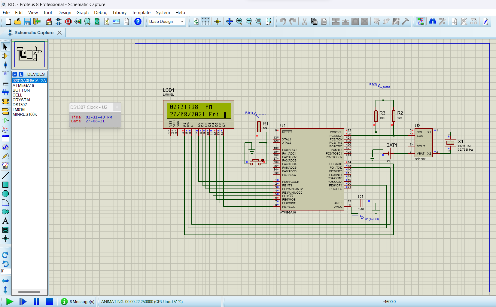
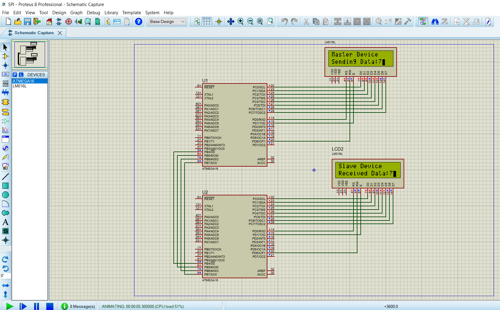

# AVR-Library
Hardware Abstraction Library for AVR Microcontrollers.

These libraries where created, debugged and tested using **Atmel Studio 7.0** and **Proteus 8** .

Some executions of Proteus are shown below:
## ADC (Analog to Digital Converter)

## I2C (Inter-Integrated Circuit)

## RTC (Real-Time Clock)

## SPI (Serial Peripheral Interface)

